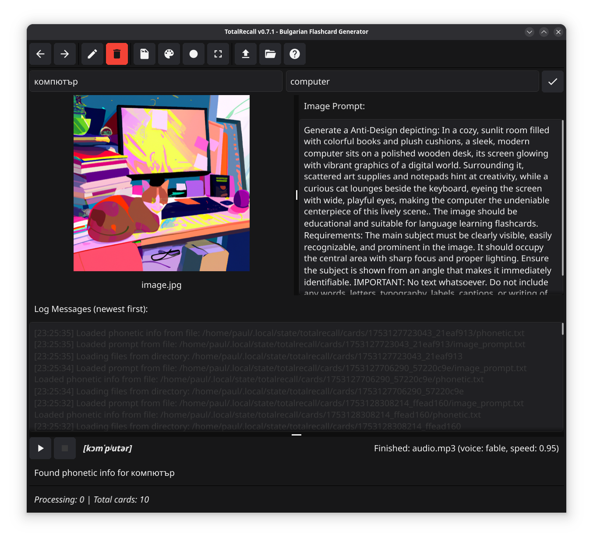

# totalrecall - Bulgarian Anki Flashcard Generator

<p align="center">
  
</p>

`totalrecall` is a versatile tool for generating Anki flashcard materials from Bulgarian words. It offers both a command-line interface (CLI) and a graphical user interface (GUI) for creating audio pronunciation files and AI-generated images.

It has mainly been vibe coded using Claude Code CLI.

<p align="center">
  
</p>

<p align="center">
  <strong>Computer / Компютър</strong><br>
  <audio controls>
    <source src="assets/audio.mp3" type="audio/mpeg">
    Your browser does not support the audio element.
  </audio>
</p>


⚠️ **Important:** This tool uses OpenAI services for audio and image generation, which requires an API key. See [Quick Start](#quick-start) for setup instructions.

## Features

- Audio generation using **OpenAI TTS**: High-quality, natural-sounding voices (requires API key)
  - Random voice selection by default for variety
  - Option to generate in all 11 available voices
- Phoenetic pronunciation:
  - Fetches IPA (International Phonetic Alphabet) for each word
- Automatic Bulgarian to English translation
  - Saves translations to separate text files
- Image generation:
  - **OpenAI DALL-E**: AI-generated educational images with contextual scenes and random art styles
  - Scene generation creates memorable contexts for each word
- Batch processing of multiple words
- Anki-compatible export
- Random voice variants and speech speed

## Installation

### Prerequisites

1. **For OpenAI TTS** (required for audio generation):
   - Create an account at https://platform.openai.com
   - Generate an API key at https://platform.openai.com/api-keys
   - Set the key using one of these methods:
     - Environment variable: `export OPENAI_API_KEY="sk-..."`
     - Configuration file: Add to `.totalrecall.yaml`

### Building from Source

```bash
git clone https://codeberg.org/snonux/totalrecall.git
cd totalrecall
go build -o totalrecall ./cmd/totalrecall
```

### Installing to Go Bin Directory

Using Task (recommended):
```bash
cd totalrecall
task install
```

Or using go install directly:
```bash
cd totalrecall
go install ./cmd/totalrecall
```

Or install from remote repository:
```bash
go install codeberg.org/snonux/totalrecall/cmd/totalrecall@latest
```

This will install the binary to `~/go/bin/totalrecall`, which should be in your PATH.

### Desktop Icon Installation (GNOME/Fedora)

TotalRecall includes a desktop icon for GNOME integration. To install:

**For current user only:**
```bash
cd totalrecall
./install-icon.sh
```

**System-wide installation:**
```bash
cd totalrecall
sudo ./install-icon.sh
```

After installation, you may need to log out and log back in for the icon to appear in GNOME's application menu. The icon will show up as "TotalRecall" in the Education category.

## Quick Start

**Note:** By default, totalrecall uses OpenAI for both audio and images. Make sure to set your OpenAI API key:
```bash
export OPENAI_API_KEY="sk-..."
```

### GUI Mode

Launch the interactive graphical interface:
```bash
totalrecall                 # GUI mode is now the default
```

The GUI is best navigated using keyboard shortcuts for efficient workflow. Press **`h`** at any time to display a complete list of all available keyboard shortcuts.

Key features:
- Fast keyboard-driven interface
- Real-time audio playback
- Batch processing support
- Visual feedback for all operations

### CLI Mode

1. Generate materials for a single word (uses OpenAI by default):
   ```bash
   totalrecall ябълка
   ```

2. Generate with specific DALL-E model:
   ```bash
   totalrecall ябълка --openai-image-model dall-e-3
   ```

3. Process multiple words from a file:
   ```bash
   totalrecall --batch words.txt
   ```
   
   Example `words.txt` with translations:
   ```
   книга = book
   стол = table
   компютър
   молив = pencil
   ```

   Have a look further below for more info about the batch file format!

4. Generate with Anki package:
   ```bash
   totalrecall ябълка --anki                                   # Creates APKG file (recommended)
   totalrecall ябълка --anki --anki-csv                        # Creates CSV file (legacy and untested)
   totalrecall ябълка --anki --deck-name "My Bulgarian Words"  # Custom deck name
   ```

5. Archive existing cards directory:
   ```bash
   totalrecall --archive                        # Archives cards to ~/.local/state/totalrecall/archive/cards-TIMESTAMP
   ```

#### Batch file format

Create a text file with Bulgarian words, optionally with English translations. The tool supports three flexible formats:

**Format 1: Bulgarian words only (will be translated to English)**
```
ябълка
котка
куче
хляб
вода
```

**Format 2: Bulgarian words with translations (no translation needed)**
```
книга = book
стол = table
прозорец = window
компютър = computer
молив = pencil
```

**Format 3: English words only (will be translated to Bulgarian)**
```
= apple
= cat
= dog
= bread
= water
```

**Format 4: Mixed format (all three types can be combined)**
```
книга = book
котка
= table
куче
молив = pencil
= window
```

When translations are provided, they are used directly without calling the translation API, saving time and API quota. When only English is provided (format starting with `=`), the tool will automatically translate it to Bulgarian. Spaces around the words and translations are automatically trimmed.

## Configuration

Create an optional `~/config/totalrecall/config.yaml` file. You can copy the example file provided.

## Output Files

By default, all files are saved to `~/.local/state/totalrecall/`. You can override this with the `-o` flag or the `output.directory` config option.

For each word, the tool generates:
- `word.mp3` - Audio pronunciation (random voice)
- `word_translation.txt` - English translation
- `word_1.jpg`, `word_2.jpg`, etc. - Generated images
- `bulgarian_vocabulary.apkg` - Anki package file (when using --anki flag)
- `anki_import.csv` - Anki import file (when using --anki --anki-csv flags)

With `--all-voices` flag:
- `word_alloy.mp3`, `word_nova.mp3`, etc. - Audio in all 11 voices

## Anki Import

### Method 1: APKG Format (Recommended)

1. Generate materials with the `--anki` flag
2. In Anki, go to File → Import
3. Select the generated `.apkg` file
4. All media files are included automatically
5. Cards are ready to use with custom styling

### Method 2: CSV Format (Legacy - and untested)

1. Generate materials with `--anki --anki-csv` flags
2. In Anki, go to File → Import
3. Select the generated `anki_import.csv`
4. Copy all media files to your Anki media folder
5. Map fields appropriately during import

### GUI Export

The GUI mode offers an export dialog where you can:
- Choose between APKG and CSV formats
- Set a custom deck name
- Export all generated cards at once
