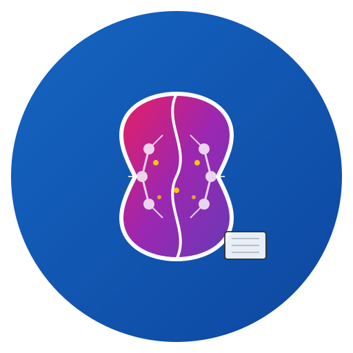
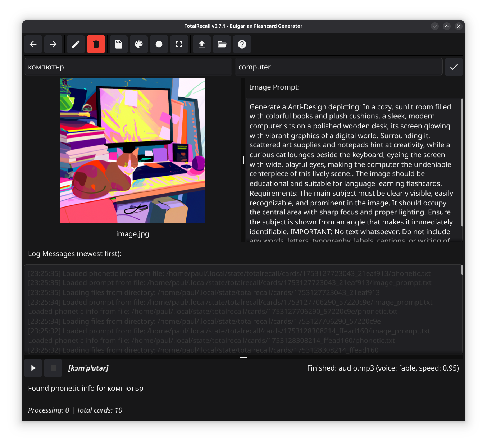
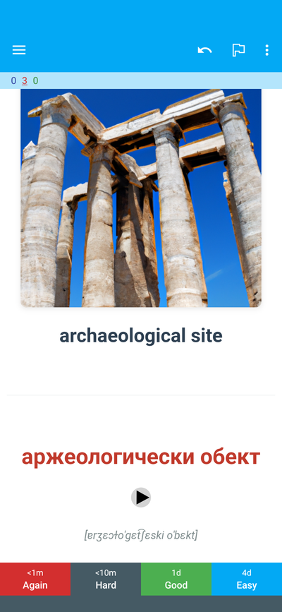

# totalrecall - Bulgarian Anki Flashcard Generator

<p align="center">
  
</p>

`totalrecall` is a versatile tool for generating Anki flashcard materials from Bulgarian words. It offers both a command-line interface (CLI) and a graphical user interface (GUI) for creating audio pronunciation files and AI-generated images.

It has mainly been vibe coded using Claude Code CLI.

⚠️ **Important:** TotalRecall now uses Google Gemini APIs by default for audio, image generation, translation, and phonetic lookup. Optional OpenAI paths are still available when explicitly selected. See [Quick Start](#quick-start) for setup instructions.

[](assets/totalrecall.png)
[🔊 Computer / Компютър audio example](assets/audio.mp3) (Download raw file, and then play locally)

<p align="center">
  
</p>

## Features

- Audio generation using **Google Gemini TTS** by default
  - Uses a random Gemini voice by default unless you select a specific one
  - Option to generate in all available voices
  - Defaults to `mp3` output and auto-converts Gemini audio with `ffmpeg` to save space
- Phoenetic pronunciation:
  - Fetches IPA (International Phonetic Alphabet) for each word
  - Uses Gemini by default
- Automatic Bulgarian to English translation
  - Saves translations to separate text files
  - Uses Gemini by default
- Image generation:
  - **Google Gemini Nano Banana**: Default image path for GUI, CLI, and batch runs
  - **OpenAI DALL-E**: Optional explicit CLI image generation path
  - **Config-driven selection**: Set `image.provider` to `openai` or `nanobanana`
  - Scene generation creates memorable contexts for each word
- Batch processing of multiple words
- **Vocabulary story generation** (`--story`):
  - Generates a ~250-word Bulgarian story that naturally uses every word in a batch file
  - All human characters are adults; story genre/setting driven by `--story-theme`
  - Produces **12 pages** per comic: cover + 5 story pages (2×2 panel grid) + 5 gallery pages (close-up character art) + back cover
  - All output saved under `comics/<title-slug>/` with files named `<slug>_*.png`
  - **Rendering mode** chosen randomly 50/50 each run; force with `--ultra-realistic` or `--no-ultra-realistic`:
    - *Ultra-realistic*: photography-language style prompt (DSLR, cinematic stills, hyper-realistic) + mandatory photorealistic rendering requirement — produces near-photographic panels
    - *Standard comic*: comic art style pool (90% "ultra realistic comic strip", 10% manga / watercolor / noir / pop-art etc.)
  - Art style override: `--story-style` replaces the random pick for both modes
  - **Iterative character consistency**: each page is generated with the cover + previous page as pixel references so characters stay visually consistent
  - **Character bible**: Gemini generates a detailed visual guide (age, clothing, colours) used in every prompt
  - **Cinematic narration** via Gemini TTS (opt-in with `--narrate`; off by default to save quota)
    - Output: `<slug>_narration.mp3` — Bulgarian phonology, dramatic pacing, random voice from a curated pool
    - Override voice with `--narrator-voice`; intro teaser + main story chunks (~100 words each) + epilogue
    - Falls back to `<slug>_tts_todo.txt` if narration fails
  - **Vocabulary learning file** (`<slug>_comic_vocabulary.txt`) — word list with translations + full story text
  - **Theme file** (`<slug>_theme.txt`) — records the `--story-theme` used for easy reproduction
- Anki-compatible export
- Random voice variants and speech speed

## Installation

### Prerequisites

1. **For Gemini defaults** (audio, images, translation, phonetics):
   - Create a Google AI Studio API key
   - Set it with `export GOOGLE_API_KEY="..."`
   - Install `ffmpeg` if you want the default space-saving `mp3` audio output

2. **For optional OpenAI paths**:
   - Create an account at https://platform.openai.com
   - Generate an API key at https://platform.openai.com/api-keys
   - Set it with `export OPENAI_API_KEY="sk-..."`

### Building from Source

```bash
git clone https://codeberg.org/snonux/totalrecall.git
cd totalrecall
go build -o totalrecall ./cmd/totalrecall
```

### Installing to Go Bin Directory

Using Task (recommended):
```bash
cd totalrecall
task install
```

Or using go install directly:
```bash
cd totalrecall
go install ./cmd/totalrecall
```

Or install from remote repository:
```bash
go install codeberg.org/snonux/totalrecall/cmd/totalrecall@latest
```

This will install the binary to `~/go/bin/totalrecall`, which should be in your PATH.

### Desktop Icon Installation (GNOME/Fedora)

TotalRecall includes a desktop icon for GNOME integration. To install:

**For current user only:**
```bash
cd totalrecall
./assets/install-icon.sh
```

**System-wide installation:**
```bash
cd totalrecall
sudo ./assets/install-icon.sh
```

After installation, you may need to log out and log back in for the icon to appear in GNOME's application menu. The icon will show up as "TotalRecall" in the Education category.

## Quick Start

**Note:** By default, totalrecall uses Gemini TTS for audio, Nano Banana for images, and Gemini-backed translation/phonetic lookup. If you want the optional OpenAI paths, set your OpenAI API key too:
```bash
export OPENAI_API_KEY="sk-..."
export GOOGLE_API_KEY="..."
```

### GUI Mode

Launch the interactive graphical interface:
```bash
totalrecall                 # GUI mode is now the default
```

The GUI is best navigated using keyboard shortcuts for efficient workflow. Press **`h`** at any time to display a complete list of all available keyboard shortcuts.

Key features:
- Fast keyboard-driven interface
- Real-time audio playback
- Batch processing support
- Visual feedback for all operations

### CLI Mode

1. Generate materials for a single word. Explicit CLI image generation uses Nano Banana by default, and you can switch to OpenAI with `--image-api openai`:
   ```bash
   totalrecall ябълка
   ```

2. Generate with specific DALL-E model:
   ```bash
   totalrecall ябълка --openai-image-model dall-e-3
   ```

3. Process multiple words from a file:
   ```bash
   totalrecall --batch words.txt
   ```
   
   Example `words.txt` with translations:
   ```
   книга = book
   стол = table
   компютър
   молив = pencil
   ```

   Have a look further below for more info about the batch file format!

4. Generate with Anki package:
   ```bash
   totalrecall ябълка --anki                                   # Creates APKG file (recommended)
   totalrecall ябълка --anki --anki-csv                        # Creates CSV file (legacy and untested)
   totalrecall ябълка --anki --deck-name "My Bulgarian Words"  # Custom deck name
   ```

5. Archive existing cards directory:
   ```bash
   totalrecall --archive                        # Archives cards to ~/.local/state/totalrecall/archive/cards-TIMESTAMP
   ```

6. Generate a vocabulary story + comic book from a batch file:
   ```bash
   totalrecall --story words.txt
   ```

   Outputs to `comics/<title-slug>/`:
   - `<slug>_story.txt` — ~250-word Bulgarian story using every word naturally
   - `<slug>_cover.png` — traditional comic book front cover with Bulgarian title
   - `<slug>_page_1.png` … `<slug>_page_5.png` — five 2×2-panel story pages (16:9)
   - `<slug>_gallery_1.png` … `<slug>_gallery_5.png` — five close-up character gallery pages
   - `<slug>_back.png` — back cover with blurb
   - `<slug>.pdf` — all pages assembled into a single PDF
   - `<slug>_narration.mp3` — cinematic Gemini TTS narration (only when `--narrate` is passed)
   - `<slug>_tts_todo.txt` — written if `--narrate` was given but narration failed
   - `<slug>_comic_vocabulary.txt` — vocabulary words + full story text for learning
   - `<slug>_theme.txt` — records `--story-theme` for easy reproduction

   Customise the story:
   ```bash
   # Set a specific theme/setting
   totalrecall --story words.txt --story-theme "a Wonder Woman inspired heroine in a futuristic city"

   # Override art style
   totalrecall --story words.txt --story-style "Japanese manga with clean linework and speed lines"
   totalrecall --story words.txt --story-style "retro 1960s pop art in the style of Roy Lichtenstein"

   # Force ultra-realistic photorealistic mode
   totalrecall --story words.txt --ultra-realistic

   # Force standard comic style (default is random 50/50 between ultra-realistic and standard)
   totalrecall --story words.txt --no-ultra-realistic

   # Enable cinematic narration (default: off — use --narrate to opt in)
   totalrecall --story words.txt --narrate

   # Choose narrator voice (default: random from pool; only relevant with --narrate)
   totalrecall --story words.txt --narrate --narrator-voice Charon    # deep, authoritative
   totalrecall --story words.txt --narrate --narrator-voice Fenrir    # strong, resonant
   totalrecall --story words.txt --narrate --narrator-voice Enceladus # breathy, intimate
   totalrecall --story words.txt --narrate --narrator-voice Algieba   # smooth, warm
   totalrecall --story words.txt --narrate --narrator-voice Aoede     # breezy, expressive
   totalrecall --story words.txt --narrate --narrator-voice Schedar   # steady, grounded

   # Repair a partial run (skip existing pages, regenerate missing ones)
   totalrecall --story words.txt --story-slug my-comic-slug
   ```

#### Optional Gallery Videos (Veo)

After `--story` comic generation completes, the CLI prompts you to generate short MP4 videos from the gallery close-up images using **Google Veo**.

**How it works:**

1. Once the comic pages, PDF, and narration are written to disk the CLI automatically searches `comics/<slug>/` for gallery PNG files.
2. It lists the found images and asks:
   ```
   Found gallery pages:
     comics/my-story/my-story_gallery_1.png
     comics/my-story/my-story_gallery_2.png
     ...
   Generate videos for these gallery pages? [y/N]:
   ```
3. If you confirm, you are asked which pages to animate:
   ```
   Which pages? (e.g. 1,3,5 or all) [all]:
   ```
4. Each selected gallery PNG is sent to the Veo API and the resulting 8-second MP4 is saved alongside the PNG:
   ```
   comics/<slug>/<slug>_gallery_1.mp4
   comics/<slug>/<slug>_gallery_2.mp4
   ...
   ```

**Model:** `veo-2.0-generate-001`

**Cost note:** Veo is a paid Google Cloud feature. Your `GOOGLE_API_KEY` must have billing enabled and the Veo API activated in your Google Cloud project. The prompt will not appear if you pass `--video=false`.

**CLI usage:**

```bash
# Default: prompt appears after story generation (answer y/N interactively)
totalrecall --story words.txt

# Skip the video prompt entirely
totalrecall --story words.txt --video=false
```

Video generation failures are non-fatal — any errors are printed as warnings and the already-generated comic, PDF, and narration remain intact on disk.

#### Batch file format

Create a text file with Bulgarian words, optionally with English translations or Bulgarian definitions. The tool supports five flexible formats:

**Format 1: Bulgarian words only (will be translated to English)**
```
ябълка
котка
куче
хляб
вода
```

**Format 2: Bulgarian words with English translations (single equals =)**
```
книга = book
стол = table
прозорец = window
компютър = computer
молив = pencil
```

Creates English→Bulgarian flashcards (front: English, back: Bulgarian).

**Format 3: English words only (will be translated to Bulgarian)**
```
= apple
= cat
= dog
= bread
= water
```

**Format 4: Bulgarian-Bulgarian (monolingual - double equals ==)**
```
ябълка == плод
котка == домашно животно
куче == млекопитающо
```

Creates Bulgarian→Bulgarian flashcards (front: Bulgarian word, back: Bulgarian definition). Useful for monolingual learning where both sides are in Bulgarian. Uses double equals (`==`) to distinguish from the English format.

**Format 5: Mixed format (all four types can be combined)**
```
книга = book
котка == домашно животно
= table
куче = dog
вода == течност
молив
```

When translations are provided, they are used directly without calling the translation API, saving time and API quota. When only English is provided (format starting with `=`), the tool will automatically translate it to Bulgarian. Spaces around the words and translations are automatically trimmed.

Bulgarian-Bulgarian cards generate two separate audio files (front and back pronunciation).

## Configuration

Create an optional `~/config/totalrecall/config.yaml` file. You can copy the example file provided:

```bash
cp assets/config.yaml.example ~/.config/totalrecall/config.yaml
```

## Output Files

By default, all files are saved to `~/.local/state/totalrecall/`. You can override this with the `-o` flag or the `output.directory` config option.

For each word, the tool generates:
- `word.mp3` - Audio pronunciation (random voice)
- `word_translation.txt` - English translation
- `word_1.jpg`, `word_2.jpg`, etc. - Generated images
- `bulgarian_vocabulary.apkg` - Anki package file (when using --anki flag)
- `anki_import.csv` - Anki import file (when using --anki --anki-csv flags)

With `--all-voices` flag:
- `word_alloy.mp3`, `word_nova.mp3`, etc. - Audio in all 11 voices

## Anki Import

### Method 1: APKG Format (Recommended)

1. Generate materials with the `--anki` flag
2. In Anki, go to File → Import
3. Select the generated `.apkg` file
4. All media files are included automatically
5. Cards are ready to use with custom styling

### Method 2: CSV Format (Legacy - and untested)

1. Generate materials with `--anki --anki-csv` flags
2. In Anki, go to File → Import
3. Select the generated `anki_import.csv`
4. Copy all media files to your Anki media folder
5. Map fields appropriately during import

### GUI Export

The GUI mode offers an export dialog where you can:
- Choose between APKG and CSV formats
- Set a custom deck name
- Export all generated cards at once
